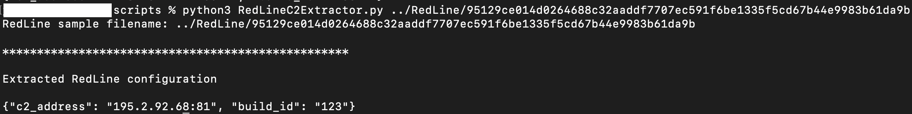

# RedLine Stealer

The script here can be used to extract configuration information from an unobfuscated sample of RedLine stealer built using the cracked builder.

See below for a example on how to run the script.

<code>python3 RedLineC2Extractor.py <path-to-RedLine-sample></code>

The results will be output to the console and saved in JSON format in the same location as the sample appended with "_config.json"

Example output from the script:

