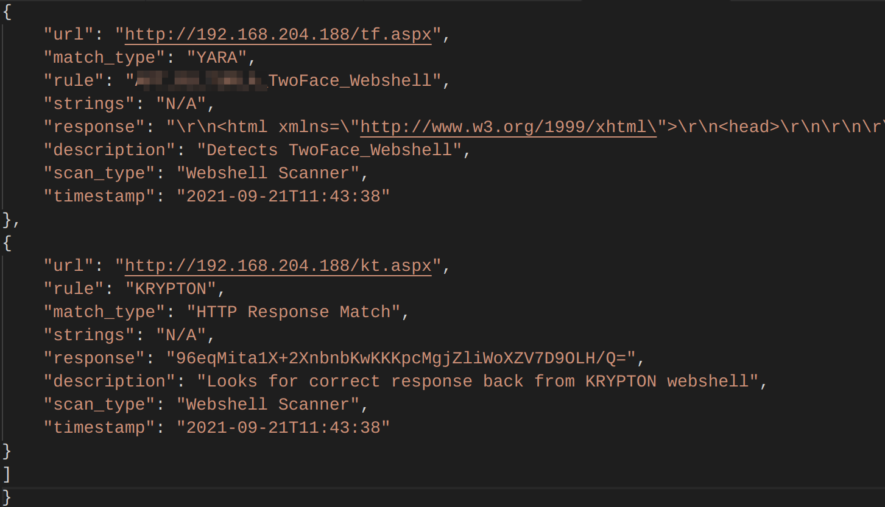

# Webshell Scanner

This is a Python script that scans for webshells by attempting to connect to common webshell URI's for a given list of domains. HTTP response content is examined for webshell indicators using YARA rules and Regular Expressions.

The script takes two arguments to run:

1. --domain: A list of domains to scan. Note, for each domain supplied, we append ~900 common webshell URIs. For internal scanning of your infrastrucutre this should pose no issues. However, for external or internet-wide scanning, we suggest pairing this list down to directories / filenames more applicable to your scan.
2. --yara: A YARA rule file is required to run this scanner, to maximize the effectivness of the results. If you are a Recorded Future customer, YARA rules specific to webshell scanning can be downloaded from our portal. YARA rules for webshells can also be found here:
    - https://github.com/Neo23x0/signature-base/search?q=webshell

See below for a example on how to run the scanner.

<code>python3 webshell_scanner.py --domain domain.txt --yara insikt_yara_rules.yar</code>

The results will be saved to the console and also as a JSON file titled ("webshell_scan.json")

